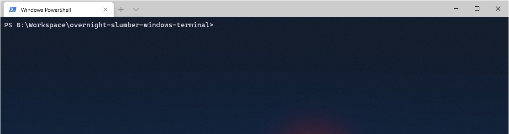

# overnight-slumber-windows-terminal
> A VSCode theme for your [Windows Terminal](https://github.com/microsoft/terminal)



## Install

Start Windows Terminal and click on the down arrow symbol from menu bar. This will open a drop down menu from which select <b>Settings</b> option. Alternatively use <kbd>ctrl</kbd> + <kbd>,</kbd> to open Settings directly.

In the profile.json settings file for Windows Terminal, find the schemes section and paste the content of `overnight_slumber.json`.

Example:

```json
"schemes": [
  {
    "name": "Overnight_Slumber",
    "background" : "#0e1729",
    "foreground": "#d6d9e0",
    "black": "#2e384d",
    "blue": "#9ac6f2",
    "brightBlack": "#3d485f",
    "brightBlue": "#acd1f5",
    "brightCyan": "#a5e0ec",
    "brightGreen": "#c9e2af",
    "brightPurple": "#ccb3ff",
    "brightRed": "#ffb3b3",
    "brightWhite": "#f2f2f2",
    "brightYellow": "#ecc48d",
    "cyan": "#92d8e6",
    "green": "#bbd99e",
    "purple": "#c1a2ff",
    "red": "#f87086",
    "white": "#d6d9e0",
    "yellow": "#ecc48d"
  }
]
```

## Activate

Once the color scheme has been defined, it's time to enable it. Find the profiles section and add a colorScheme value to the default profile.

Example:

```json
"profiles": {
  "defaults": {
    "colorScheme" : "Overnight_Slumber"
  }
}
```

## Credits

Inspired on: 
<a href="https://draculatheme.com/windows-terminal" target="_blank">Dracula Theme Documentation</a>

Terminal font: <a href="https://github.com/microsoft/cascadia-code" target="_blank">Cascadia Fonts</a>

VSCode Theme: <a href="https://marketplace.visualstudio.com/items?itemName=cev.overnight" target="_blank">Overnight</a>